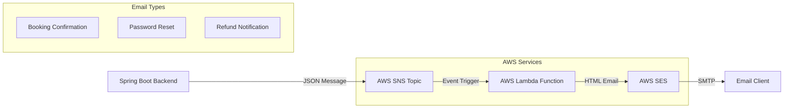
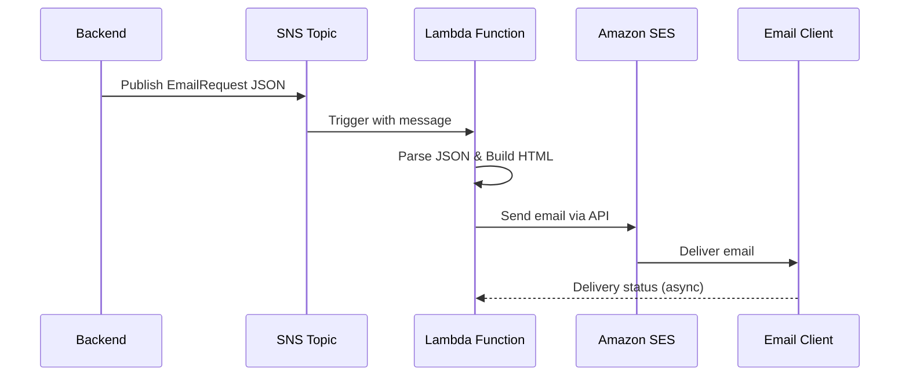

# 🎬 Movie Ticket Email System Architecture
**SNS → Lambda → SES Implementation Guide**

---

## 📊 System Overview



## 🏗️ Architecture Components

### 1. Backend Integration (Spring Boot)
```java
@Service
public class EmailService {
    private SnsClient snsClient;
    
    @Async
    public void sendBookingConfirmation(Booking booking) {
        EmailRequest request = EmailRequest.builder()
            .emailType(BOOKING_CONFIRMATION)
            .toEmail(booking.getCustomerEmail())
            .templateData(buildTemplateData(booking))
            .build();
        publishToSns(request);
    }
}
```

### 2. SNS Topic Configuration
- **Topic ARN**: `arn:aws:sns:ap-southeast-1:024958414130:movie-ticket-email-service-email-topic-prod`
- **Region**: `ap-southeast-1`
- **Subscription**: Lambda function

### 3. Lambda Function (Python 3.11)
- **Runtime**: Python 3.11
- **Memory**: 256 MB
- **Timeout**: 30 seconds
- **Handler**: `email_handler.lambda_handler`

### 4. SES Configuration
- **FROM Email**: `q2kcinema@gmail.com`
- **Verified Domain**: `q2k.click`
- **Mode**: Sandbox (upgrade to Production for unlimited recipients)

---

## 🚀 Deployment Flow



---

## 📋 Setup Checklist

### ✅ Infrastructure
- [x] CloudFormation stack deployed
- [x] SNS Topic created
- [x] Lambda function configured
- [x] IAM roles and permissions

### ✅ SES Configuration
- [x] Domain `q2k.click` verified
- [x] Email `q2kcinema@gmail.com` verified
- [x] Test recipient verified (sandbox mode)

### ✅ Backend Integration
- [x] AWS SDK dependencies added
- [x] EmailService implemented
- [x] EmailRequest DTO created
- [x] Configuration updated

### ✅ Testing & Validation
- [x] SNS message publishing works
- [x] Lambda function processes messages
- [x] Emails delivered successfully
- [x] QR codes display correctly

---

## 🛠️ Configuration Files

### application.properties
```properties
# AWS SNS Email Configuration
aws.sns.email-topic-arn=arn:aws:sns:ap-southeast-1:024958414130:movie-ticket-email-service-email-topic-prod
aws.region=ap-southeast-1
email.service.enabled=true
```

### CloudFormation Resources
```yaml
Resources:
  EmailSNSTopic:
    Type: AWS::SNS::Topic
  EmailLambdaFunction:
    Type: AWS::Lambda::Function
    Runtime: python3.11
  EmailLambdaExecutionRole:
    Type: AWS::IAM::Role
```

---

## 📧 Email Templates

### 1. Booking Confirmation
**Features:**
- Customer information
- Movie details (title, cinema, time)
- QR code for check-in
- Booking code
- Total amount
- Important notes

### 2. Password Reset
**Features:**
- 6-digit verification code
- 15-minute expiration warning
- Security instructions
- Professional styling

### 3. Refund Confirmation
**Features:**
- Refund amount
- Processing timeline
- Transaction details

---

## 🧪 Testing Commands (Windows)

### Deploy Infrastructure
```powershell
aws cloudformation create-stack `
  --stack-name movie-ticket-email-service `
  --template-body file://email-service-complete.yaml `
  --parameters ParameterKey=Environment,ParameterValue=prod `
  --capabilities CAPABILITY_NAMED_IAM `
  --region ap-southeast-1
```

### Test Email Sending
```powershell
$testMessage = @{
    emailType = "BOOKING_CONFIRMATION"
    toEmail = "test@example.com"
    templateData = @{
        customerName = "John Doe"
        bookingCode = "BK123456"
        movieTitle = "Spider-Man"
        qrCodeUrl = "https://s3.amazonaws.com/qr.png"
    }
} | ConvertTo-Json -Depth 3

aws sns publish --topic-arn $topicArn --message $testMessage --region ap-southeast-1
```

### Monitor Logs
```powershell
aws logs get-log-events `
  --log-group-name /aws/lambda/movie-ticket-email-service-email-handler-prod `
  --log-stream-name $streamName `
  --region ap-southeast-1
```

---

## 🔧 Troubleshooting

### Common Issues

| Issue | Solution |
|-------|----------|
| Email not received | Check SES verification status |
| Lambda timeout | Increase timeout or optimize code |
| Permission denied | Verify IAM roles and policies |
| QR code not showing | Check S3 URL accessibility |
| JSON parse error | Validate message format |

### Diagnostic Commands
```powershell
# Check SES verification
aws ses get-identity-verification-attributes --identities q2k.click --region ap-southeast-1

# Check Lambda function
aws lambda get-function --function-name email-handler-prod --region ap-southeast-1

# Check SNS topic
aws sns get-topic-attributes --topic-arn $topicArn --region ap-southeast-1
```

---

## 📊 Monitoring & Metrics

### CloudWatch Metrics
- **EmailSent**: Total emails sent by type
- **EmailError**: Failed email attempts
- **Lambda Duration**: Function execution time
- **Lambda Errors**: Function error count

### Log Analysis
- SNS message processing
- Email template generation
- SES delivery status
- Error tracking and alerts

---

## 💰 Cost Breakdown

| Service | Cost | Usage |
|---------|------|-------|
| SNS | $0.50 per 1M messages | Message publishing |
| Lambda | $0.20 per 1M requests | Email processing |
| SES | $0.10 per 1K emails | Email delivery |
| CloudWatch | $0.50 per GB | Logs storage |

**Estimated monthly cost for 10,000 emails: ~$5**

---

## 🚀 Production Readiness

### Security
- ✅ IAM roles with minimal permissions
- ✅ Encrypted environment variables
- ✅ VPC configuration (optional)

### Scalability
- ✅ Auto-scaling Lambda functions
- ✅ SNS high throughput
- ✅ SES sending limits monitoring

### Reliability
- ✅ Dead letter queues
- ✅ Retry mechanisms
- ✅ Error handling

### Monitoring
- ✅ CloudWatch dashboards
- ✅ Custom metrics
- ✅ Alerting rules

---

## 📈 Future Enhancements

### Phase 2 Features
- [ ] Email template versioning
- [ ] A/B testing for email content
- [ ] Advanced analytics and tracking
- [ ] Multi-language support
- [ ] Email scheduling
- [ ] Attachment support

### Infrastructure Improvements
- [ ] Multi-region deployment
- [ ] Blue-green deployments
- [ ] Enhanced security scanning
- [ ] Performance optimization

---

## 📞 Support & Maintenance

### Regular Tasks
- Monitor SES bounce rates
- Update Lambda function code
- Review CloudWatch logs
- Update email templates
- Check SES reputation

### Emergency Procedures
1. **High Error Rate**: Scale Lambda concurrency
2. **SES Issues**: Switch to backup email service
3. **Lambda Failure**: Deploy rollback version
4. **SNS Problems**: Check topic configuration

---

## 📝 Documentation Links

- [AWS SNS Documentation](https://docs.aws.amazon.com/sns/)
- [AWS Lambda Documentation](https://docs.aws.amazon.com/lambda/)
- [AWS SES Documentation](https://docs.aws.amazon.com/ses/)
- [CloudFormation Templates](./setup-guide/)
- [Testing Scripts](./setup-guide/)

---

**🎉 Status: Production Ready**
**📅 Last Updated: December 11, 2025**
**👨‍💻 Maintained by: Development Team**